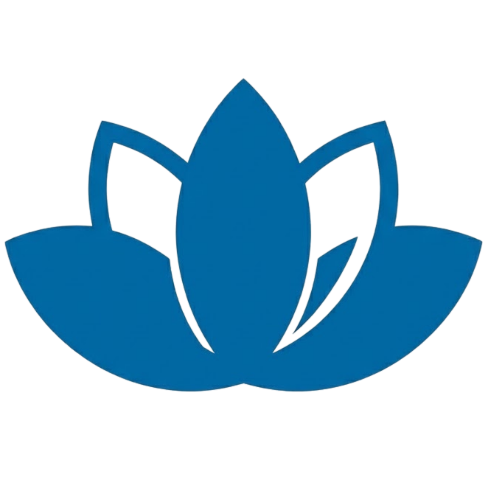
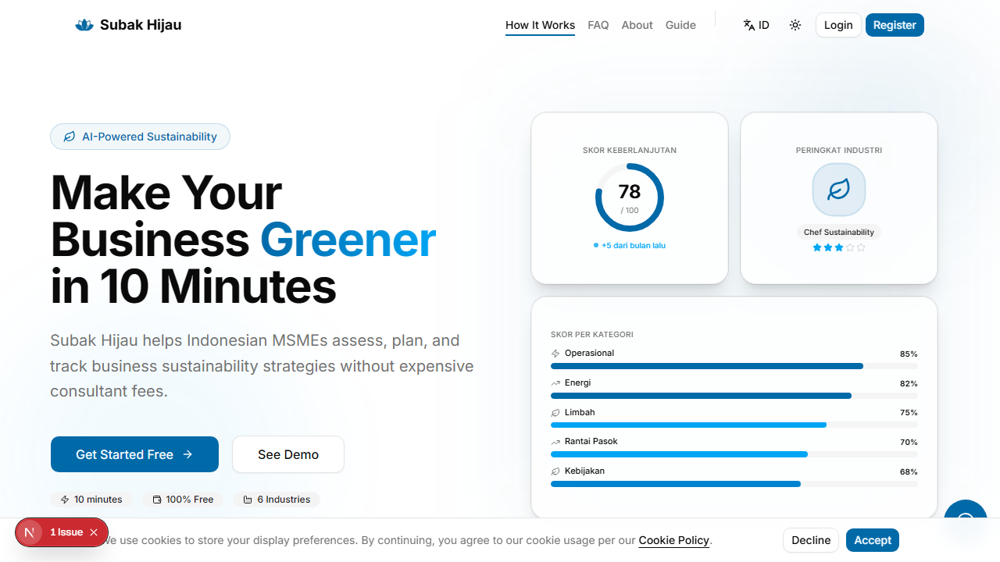
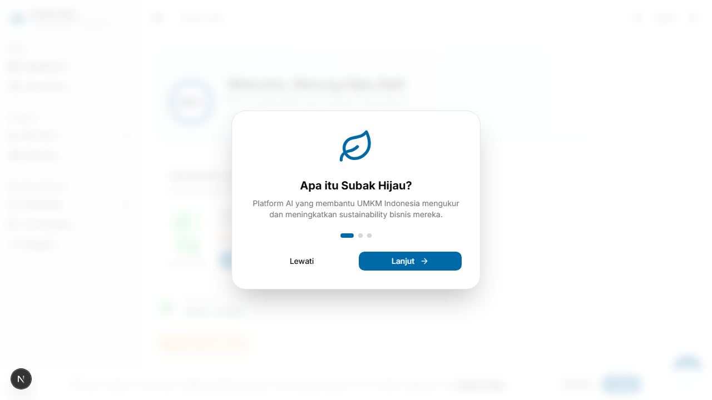
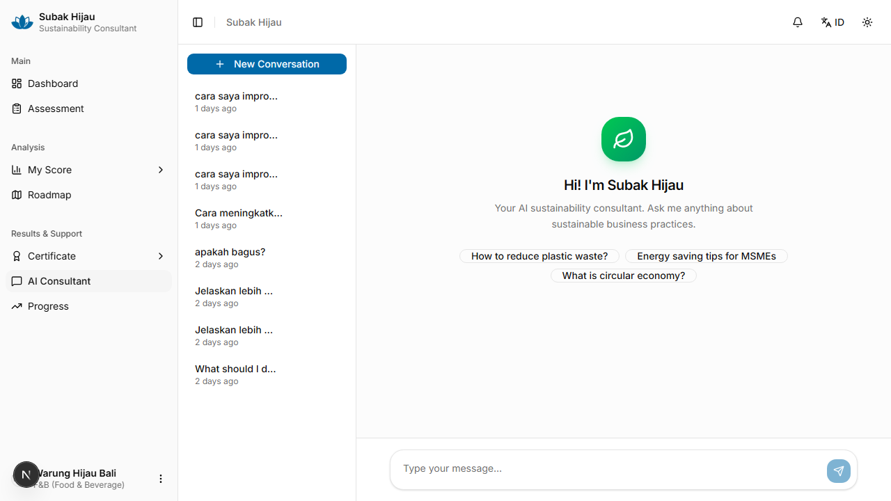
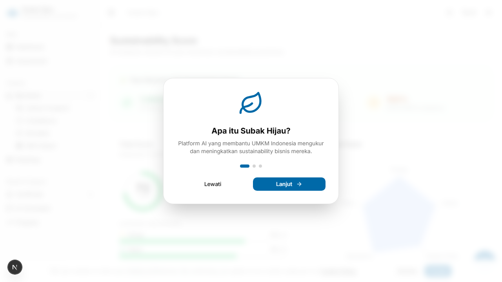
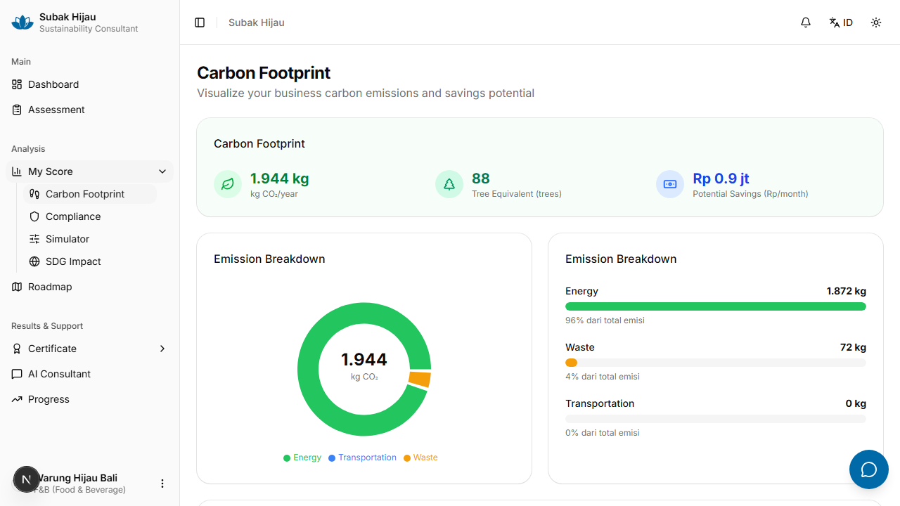
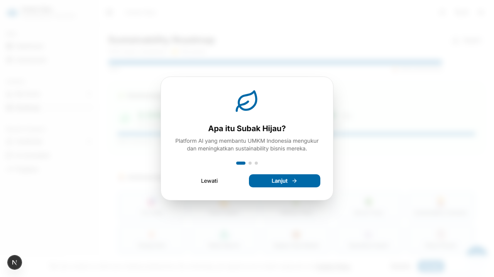

<p align="center">
  
</p>

<h1 align="center">Subak Hijau</h1>

<p align="center">
  <strong>Konsultan Sustainability AI untuk UMKM Indonesia</strong><br/>
  <em>AI-Powered Sustainability Consultant for Indonesian MSMEs</em>
</p>

<p align="center">
  
  
  
  
  
  
  
</p>

<p align="center">
  🏆 <strong>PROXOCORIS 2026</strong> — Tim SubakCode
</p>

---

## 🔥 Permasalahan / *The Problem*

**🇮🇩 Bahasa Indonesia**

Indonesia memiliki **65 juta UMKM** — tulang punggung ekonomi nasional yang menyumbang lebih dari 60% PDB. Namun, hampir tidak ada UMKM yang punya akses ke panduan sustainability yang terjangkau. Konsultasi tradisional memakan biaya puluhan hingga ratusan juta rupiah per proyek, sehingga hanya perusahaan besar yang mampu membayar. Akibatnya, jutaan UMKM terus berkontribusi terhadap emisi karbon tanpa alat bantu, arahan, atau pemahaman yang memadai tentang regulasi keberlanjutan yang berlaku. Di saat tekanan regulasi semakin meningkat (POJK 51/2017, TKBI, IFRS S1/S2), UMKM tidak memiliki sumber daya untuk memenuhinya. Belum ada satupun platform AI sustainability yang dirancang khusus untuk kebutuhan UMKM di emerging market.

**🇬🇧 English**

Indonesia has **65 million MSMEs** — the backbone of its national economy, contributing over 60% of GDP. Yet almost none have access to affordable sustainability guidance. Traditional consulting costs tens to hundreds of millions of rupiah per project, making it accessible only to large corporations. As a result, millions of MSMEs continue contributing to carbon emissions without adequate tools, guidance, or understanding of applicable sustainability regulations. As regulatory pressure intensifies (POJK 51/2017, TKBI, IFRS S1/S2), MSMEs lack the resources to comply. There is currently zero AI sustainability platform designed specifically for MSMEs in emerging markets.

| | Fakta / *Fact* |
|---|---|
| 💰 | Konsultasi sustainability tradisional: **$5.000–$200.000+** per proyek |
| 📊 | Hanya **7,7%** UKM global yang melakukan sustainability reporting |
| 🏭 | UMKM Indonesia menghasilkan **216 juta ton CO₂/tahun** |
| 🤖 | **Nol** platform AI sustainability untuk UMKM di emerging market |
| 📜 | Tekanan regulasi meningkat: POJK 51/2017, TKBI, IFRS S1/S2 |

---

## 💡 Solusi / *The Solution*

**🇮🇩 Bahasa Indonesia**

**Subak Hijau** adalah aplikasi web berbasis AI yang membantu UMKM Indonesia menilai, memahami, dan meningkatkan praktik keberlanjutan bisnis mereka — dengan biaya **Rp 0** dibanding jutaan rupiah untuk konsultan tradisional. Dilengkapi kalkulator karbon berbasis faktor emisi Indonesia, analisis kepatuhan regulasi, simulator penghematan biaya, dashboard SDG, sistem gamifikasi industri-spesifik, dan konsultan AI real-time yang memahami konteks bisnis Indonesia. Nama "Subak" terinspirasi dari sistem irigasi tradisional Bali yang diakui UNESCO sebagai warisan budaya dunia — simbol kolaborasi dan keberlanjutan yang sudah tertanam dalam budaya Indonesia selama berabad-abad.

**🇬🇧 English**

**Subak Hijau** is an AI-powered web application that helps Indonesian MSMEs assess, understand, and improve their business sustainability practices — at **zero cost** compared to millions of rupiah for traditional consultants. It includes a carbon calculator using Indonesian emission factors, regulatory compliance analysis, cost savings simulator, SDG dashboard, industry-specific gamification system, and a real-time AI consultant that understands the Indonesian business context. The name "Subak" is inspired by the traditional Balinese irrigation system recognized by UNESCO as a World Cultural Heritage — a symbol of collaboration and sustainability embedded in Indonesian culture for centuries.

### Mengapa Subak Hijau? / *Why Subak Hijau?*

| Konsultan Tradisional | Subak Hijau |
|----------------------|-------------|
| Biaya $5.000–$200.000+ | **Gratis** |
| Proses berminggu-minggu | Hasil dalam **hitungan menit** |
| Laporan statis satu kali | **Tracking progres berkelanjutan** |
| Generik, tidak spesifik industri | **Personalisasi per industri** (6 jenis) |
| Tidak ada engagement berkelanjutan | **Gamifikasi** (ranks, streaks, badges) |
| Bahasa Inggris | **Bilingual** (Bahasa Indonesia + English) |

---

## ✨ Fitur Utama / *Key Features*

| Fitur | Deskripsi / *Description* |
|-------|--------------------------|
| 📝 **Assessment Interaktif** | Formulir multi-langkah untuk mengevaluasi 5 aspek keberlanjutan: energi, limbah, rantai pasok, operasional, kebijakan |
| ⚡ **Quick Assessment** | Evaluasi cepat untuk mendapatkan gambaran umum sustainability bisnis |
| 🎯 **Skor AI (0–100)** | Analisis komprehensif per kategori dengan radar chart, AI summary, dan benchmark industri |
| 🧮 **Kalkulator Karbon** | Estimasi CO₂/tahun, penghematan Rp/bulan, dan persentase kepatuhan regulasi (POJK, TKBI) |
| 💹 **Simulator Penghematan** | Proyeksi penghematan biaya berdasarkan skenario perbaikan sustainability |
| ⚖️ **Kepatuhan Regulasi** | Cek kepatuhan terhadap POJK 51/2017, TKBI, dan IFRS S1/S2 |
| 🌐 **SDG Dashboard** | Visualisasi keselarasan bisnis dengan SDG 7, 12, dan 13 |
| 🗺️ **Roadmap Personalisasi** | 8–12 langkah aksi yang diprioritaskan berdasarkan dampak, biaya, dan timeline |
| 💬 **Chat AI Konsultan** | Konsultasi real-time dengan AI yang memahami konteks bisnis dan skor sustainability Anda |
| 🛠️ **AI Tools** | `calculateCO2` — hitung jejak karbon, `lookupRegulation` — cari regulasi Indonesia, `getIndustryBenchmark` — bandingkan dengan industri sejenis |
| 📊 **Perbandingan Industri** | Benchmark percentile: "Di atas X% perusahaan Y" |
| 🏅 **Achievement System** | Badges berdasarkan penyelesaian roadmap, 5-tier ranks untuk 6 industri |
| 🎴 **Shareable Achievement Cards** | Kartu achievement format IG Story (1080x1920) yang bisa dibagikan |
| 📜 **Sertifikat + QR Verification** | Sertifikat sustainability dengan verifikasi publik via `/verify/[token]` |
| 🔥 **Weekly Streaks** | Pelacakan streak assessment mingguan berbasis ISO week |
| 🎊 **Confetti Celebrations** | Animasi celebrasi di milestone 25%, 50%, 75%, dan 100% |
| 📈 **Tracking Progres** | Visualisasi riwayat skor dan progres per kategori |
| 🖨️ **Laporan Cetak** | Printable report: jejak karbon + kepatuhan regulasi + skor AI |
| 🌍 **Bilingual** | Antarmuka Bahasa Indonesia & English dengan toggle bahasa |
| 🌙 **Dark Mode** | Toggle tema gelap/terang (tekan `d`) |
| 📱 **Mobile Bottom Nav** | Navigasi bawah 5-item untuk mobile, sidebar untuk desktop — fully responsive |
| 🎞️ **Scroll Animations** | Framer Motion entrance animations yang dipicu saat scroll di landing page |

---

## 🛠️ Tech Stack

| Teknologi | Versi | Kegunaan / *Purpose* |
|-----------|-------|----------------------|
| ⚡ Next.js | 16 | App Router, Server Components, Turbopack |
| ⚛️ React | 19 | UI framework dengan Server Components |
| 🔷 TypeScript | 5 | Type safety (strict mode) |
| 🎨 Tailwind CSS | 4 | Utility-first styling via `@tailwindcss/postcss` |
| 🧱 shadcn/ui | 4 | Komponen UI (Radix-based, pre-styled) |
| 🗄️ Supabase | — | PostgreSQL, Auth, RLS (Row Level Security) |
| 🤖 Vercel AI SDK | 6 | Streaming chat, structured generation, tool calling |
| 📊 Recharts | 3 | Radar chart, line chart, data visualization |
| 🎞️ Framer Motion | 12 | Scroll-triggered entrance animations |
| 🔐 Zod | 4 | Schema validation & structured AI output |

---

## 🏗️ Arsitektur / *Architecture*

### 📂 Route Tree (38 routes: 31 pages + 7 API)

```
App Router
│
├── /                                    🏠 Landing page (publik)
│
│  ── Auth ──────────────────────────────────────────────
├── /(auth)/login                        🔐 Login
├── /(auth)/register                     📝 Register
│
│  ── Onboarding ────────────────────────────────────────
├── /onboarding                          🎯 Setup profil bisnis
│
│  ── Public Pages ──────────────────────────────────────
├── /(public)/about                      ℹ️  Tentang kami
├── /(public)/faq                        ❓ FAQ
├── /(public)/contact                    📧 Kontak
├── /(public)/panduan                    📖 Panduan penggunaan
├── /(public)/terms                      📃 Syarat & ketentuan
├── /(public)/privacy                    🔒 Kebijakan privasi
├── /(public)/cookies                    🍪 Kebijakan cookie
├── /(public)/disclaimer                 ⚠️  Disclaimer
│
│  ── Dashboard (Protected) ─────────────────────────────
├── /dashboard                           📊 Overview + statistik
├── /dashboard/assessment                📝 Assessment (5 langkah)
├── /dashboard/assessment/quick          ⚡ Quick assessment
├── /dashboard/score                     🎯 Hasil skor AI + radar chart
├── /dashboard/score/report              🖨️ Laporan cetak
├── /dashboard/roadmap                   🗺️ Roadmap aksi
├── /dashboard/chat                      💬 Konsultasi AI
├── /dashboard/carbon                    🧮 Kalkulator karbon
├── /dashboard/simulator                 💹 Simulator penghematan
├── /dashboard/compliance                ⚖️ Kepatuhan regulasi
├── /dashboard/sdg                       🌐 Dashboard SDG
├── /dashboard/comparison                📊 Perbandingan industri
├── /dashboard/certificate               📜 Sertifikat sustainability
├── /dashboard/achievement               🏅 Achievement badges
├── /dashboard/progress                  📈 Riwayat + tracking
├── /dashboard/settings                  ⚙️ Pengaturan
├── /dashboard/help                      🆘 Bantuan
│
│  ── Verification (Public) ─────────────────────────────
├── /verify/[token]                      ✅ Verifikasi sertifikat (publik)
├── /verify/[token]/achievement          🏅 Verifikasi achievement (publik)
│
│  ── API Routes ────────────────────────────────────────
├── /api/auth/callback                   🔐 OAuth callback
├── /api/chat                            🤖 Streaming AI chat
├── /api/assessment/score                🎯 AI scoring
├── /api/assessment/roadmap              🗺️ AI roadmap generation
├── /api/conversations                   💬 List conversations
├── /api/conversations/[id]              💬 Single conversation
└── /api/seed                            🌱 Demo data seeding
```

### 🤖 Integrasi AI / *AI Integration*

Subak Hijau menggunakan **Vercel AI SDK v6** dengan pola modern:

| Fitur | Method | Detail |
|-------|--------|--------|
| 💬 Chat | `streamText()` | Streaming real-time + tool calling (CO₂, regulasi, benchmark) |
| 🎯 Scoring | `generateText()` + `Output.object()` | Structured output dengan Zod schema (skor 0–100 per kategori) |
| 🗺️ Roadmap | `generateText()` + `Output.object()` | 8–12 langkah aksi terstruktur dengan prioritas & timeline |
| 🔀 Model Routing | AI Gateway | Primary: Claude Sonnet, Fallback: GPT-4o |
| 🧠 Context Injection | System Prompt | Profil bisnis, skor, industry weights disuntikkan ke prompt |
| 🔄 Multi-step | `stopWhen: stepCountIs(N)` | Tool calling multi-langkah untuk analisis mendalam |

**Client-side Chat Pattern:**
- `DefaultChatTransport` untuk koneksi ke `/api/chat`
- `sendMessage({ text })` untuk mengirim pesan
- `message.parts` untuk render response (text, tool calls, tool results)
- `isToolUIPart()` + `state: 'output-available'` untuk menampilkan hasil tool

### 🛠️ AI Chat Tools

| Tool | Fungsi / *Function* | Input |
|------|---------------------|-------|
| `calculateCO2` | Hitung jejak karbon dari data assessment | Jenis energi, konsumsi kWh, jumlah kendaraan |
| `lookupRegulation` | Cari regulasi sustainability Indonesia | Kata kunci regulasi (POJK, TKBI, IFRS) |
| `getIndustryBenchmark` | Bandingkan skor dengan rata-rata & top performer | Jenis industri, kategori skor |

---

## 📸 Screenshots

| Halaman | Preview |
|---------|---------|
| Landing Page |  |
| Dashboard Overview |  |
| AI Chat Konsultan |  |
| Skor AI + Radar Chart |  |
| Kalkulator Karbon |  |
| Roadmap Aksi |  |

> Jalankan `npm run screenshots` untuk generate screenshot terbaru dari aplikasi yang sedang berjalan.

---

## 🚀 Getting Started

### 📋 Prerequisites

- **Node.js** 18+
- **npm** atau **pnpm**
- Akun [Supabase](https://supabase.com) (gratis)
- API key AI (Anthropic atau OpenAI, via AI Gateway)

### 📦 Instalasi / *Installation*

```bash
# Clone repository
git clone https://github.com/weidaksatriawarma/subak-bali-next.git
cd subak-bali-next

# Install dependencies
npm install

# Setup environment variables
cp .env.example .env.local
# Edit .env.local dengan credentials Anda

# Jalankan migrasi database
# Import file SQL dari supabase/migrations/ ke Supabase Dashboard
# Urutan: 000_all.sql → 001_extensions.sql → ... → 010_indexes.sql

# Start development server
npm run dev
```

Buka [http://localhost:3000](http://localhost:3000) di browser Anda.

### 📜 Scripts

```bash
npm run dev          # ⚡ Start dev server (Turbopack)
npm run build        # 📦 Production build
npm run lint         # 🔍 ESLint (flat config, Next.js core-web-vitals + TypeScript)
npm run typecheck    # 🔷 TypeScript type checking (tsc --noEmit)
npm run format       # ✨ Prettier formatting (no semicolons, double quotes)
```

---

## 🔐 Environment Variables

```env
# Supabase
NEXT_PUBLIC_SUPABASE_URL=https://your-project.supabase.co
NEXT_PUBLIC_SUPABASE_ANON_KEY=your-supabase-anon-key

# AI Gateway (Anthropic / OpenAI via Vercel AI Gateway)
AI_GATEWAY_API_KEY=your-ai-gateway-key

# Production seed (opsional, untuk demo data)
SEED_SECRET=your-random-secret
```

---

## 📁 Struktur Proyek / *Project Structure*

```
subak-bali-next/
│
├── app/                              Next.js App Router pages & API routes
│   ├── (auth)/                       Login & register
│   │   ├── login/page.tsx
│   │   └── register/page.tsx
│   ├── (public)/                     Public pages (about, faq, contact, legal)
│   │   ├── about/page.tsx
│   │   ├── faq/page.tsx
│   │   ├── contact/page.tsx
│   │   ├── panduan/page.tsx
│   │   ├── terms/page.tsx
│   │   ├── privacy/page.tsx
│   │   ├── cookies/page.tsx
│   │   └── disclaimer/page.tsx
│   ├── dashboard/                    Protected dashboard routes (15 pages)
│   ├── verify/                       Public certificate & achievement verification
│   ├── onboarding/                   Multi-step business profile setup
│   └── api/                          API endpoints (7 routes)
│
├── components/
│   ├── ui/                           shadcn/ui primitives (auto-generated)
│   ├── dashboard/                    Sidebar, bottom-nav, charts, celebrations, streaks, ranks
│   ├── forms/                        Assessment, onboarding & industry questions
│   ├── landing/                      Landing page sections + motion wrappers
│   └── shared/                       Reusable components (empty state, etc.)
│
├── lib/
│   ├── ai/                           Prompts, Zod schemas, tools, regulations data
│   │   ├── prompts.ts                System prompts with context injection
│   │   ├── schemas.ts                Zod schemas for AI structured output
│   │   ├── tools.ts                  Chat tools (calculateCO2, lookupRegulation, etc.)
│   │   └── regulations.ts            Indonesian sustainability regulations data
│   ├── gamification/                 Industry ranks, scoring weights, celebrations, streaks
│   │   ├── industry-data.ts          5-tier ranks x 6 industries
│   │   ├── industry-questions.ts     Industry-specific assessment questions
│   │   ├── celebrations.ts           Milestone celebration triggers
│   │   └── streaks.ts                ISO week-based streak tracking
│   ├── i18n/                         Internationalization (ID/EN dictionaries)
│   ├── supabase/                     Client helpers (SSR pattern)
│   │   ├── client.ts                 Browser client (createBrowserClient)
│   │   ├── server.ts                 Server client (createServerClient)
│   │   └── middleware.ts             Middleware client
│   ├── achievements.ts               Achievement badges system
│   ├── carbon.ts                     Carbon calculator & compliance checker
│   ├── constants.ts                  Indonesian labels for all enums
│   ├── security.ts                   Rate limiting & prompt sanitization
│   └── utils.ts                      Utility functions (cn helper)
│
├── types/                            TypeScript type definitions
│   └── database.ts                   Supabase table interfaces
├── public/
│   ├── images/logo/                  Logo files
│   ├── manifest.json                 PWA manifest
│   └── sw.js                         Service worker
├── supabase/migrations/              SQL migrations (000–010, 11 files)
├── .github/workflows/                CI/CD (ci.yml, security.yml, lighthouse.yml)
├── middleware.ts                     Auth route protection
└── next.config.ts                    Next.js configuration (security headers, redirects)
```

---

## 🗄️ Database Schema

Supabase PostgreSQL dengan Row Level Security (RLS).
Migrasi: 11 file SQL (`000_all.sql` s.d. `010_indexes.sql`).

| Tabel | Kolom Utama | Deskripsi / *Description* |
|-------|-------------|--------------------------|
| 👤 `profiles` | `business_name`, `industry_type`, `company_size`, `location` | Profil bisnis pengguna |
| 📝 `assessments` | 15+ fields per 5 kategori, `industry_answers` | Data assessment sustainability |
| 🎯 `scores` | `total_score`, 5 kategori, `ai_summary`, `benchmark`, `certificate_token` | Skor AI per assessment |
| 🗺️ `roadmaps` | `assessment_id`, `status`, `completed_count` | Roadmap yang di-generate AI |
| ✅ `roadmap_items` | `title`, `priority`, `impact`, `cost`, `timeline`, `completed` | Langkah aksi individual (8–12 per roadmap) |
| 💬 `chat_conversations` | `title`, `user_id`, `created_at` | Riwayat percakapan chat |
| 📨 `chat_messages` | `role`, `content`, `parts`, `conversation_id` | Pesan chat individual |

---

## 🧮 Kalkulator Karbon / *Carbon Calculator*

Subak Hijau menyertakan kalkulator karbon yang menggunakan **faktor emisi Indonesia** berdasarkan data PLN dan standar nasional:

### Faktor Emisi / *Emission Factors*

| Sumber Energi | Faktor (kg CO₂/kWh) | Keterangan |
|---------------|---------------------|------------|
| ⚡ PLN Grid | 0.78 | Jaringan listrik nasional |
| ☀️ PLN + Solar | 0.39 | Hybrid grid + solar panel |
| 🌞 Solar Only | 0.05 | Sepenuhnya energi surya |
| 🛢️ Genset Diesel | 0.84 | Generator diesel (tertinggi) |

### Output Kalkulator

| Output | Satuan | Keterangan |
|--------|--------|------------|
| 📊 Estimasi emisi CO₂ | ton/tahun | Total jejak karbon tahunan bisnis |
| 💰 Potensi penghematan | Rp/bulan | Estimasi penghematan biaya energi |
| ⚖️ Kepatuhan regulasi | % | Persentase kepatuhan terhadap POJK 51/2017 & TKBI |

### Kerangka Regulasi / *Regulatory Framework*

| Regulasi | Cakupan |
|----------|---------|
| **POJK 51/2017** | Keuangan Berkelanjutan — wajib untuk lembaga keuangan, referensi untuk UMKM |
| **TKBI** | Taksonomi Keuangan Berkelanjutan Indonesia |
| **IFRS S1/S2** | Standar pelaporan sustainability internasional |

---

## 🏅 Sistem Gamifikasi / *Gamification System*

Subak Hijau menggunakan sistem gamifikasi industri-spesifik untuk memotivasi UMKM dalam perjalanan sustainability mereka.

### Industry Ranks (5 Tier x 6 Industri)

Sistem peringkat 5-tier yang berbeda untuk setiap jenis industri:

| Industri | Tier 1 (Pemula) | Tier 3 (Menengah) | Tier 5 (Master) |
|----------|----------------|-------------------|-----------------|
| 🍽️ F&B | Warung Pemula | Restoran Hijau | Chef Sustainability |
| 🛍️ Retail | Toko Hijau Pemula | Retail Eco-Friendly | Retail Sustainability Leader |
| 🏭 Manufacturing | Pabrik Pemula | Manufaktur Efisien | Manufaktur Net-Zero |
| 💼 Services | Kantor Pemula | Jasa Berkelanjutan | Jasa Sustainability Champion |
| 🌾 Agriculture | Petani Pemula | Pertanian Organik | Agrikultur Regeneratif |
| 📦 General | Pemula Hijau | Praktisi Hijau | Sustainability Expert |

### Scoring Weights per Industri

Bobot penilaian berbeda per industri untuk hasil yang lebih relevan:

| Industri | Energi | Limbah | Rantai Pasok | Operasional | Kebijakan |
|----------|--------|--------|-------------|-------------|-----------|
| 🍽️ F&B | 20% | **30%** | 20% | 15% | 15% |
| 🏭 Manufacturing | **30%** | 25% | 20% | 15% | 10% |
| 🛍️ Retail | 20% | 20% | **25%** | 20% | 15% |
| 💼 Services | 25% | 15% | 15% | **25%** | 20% |
| 🌾 Agriculture | 20% | 20% | 20% | **25%** | 15% |

> **Catatan**: Bobot yang **ditebalkan** menunjukkan kategori dengan bobot tertinggi per industri. Misalnya, industri F&B memiliki bobot limbah tertinggi (30%) karena pengelolaan food waste adalah tantangan utama di sektor ini.

### Fitur Gamifikasi Lainnya / *Other Gamification Features*

| Fitur | Deskripsi |
|-------|-----------|
| 🏅 **Achievements** | Badges yang didapat dengan menyelesaikan roadmap items |
| 🎊 **Celebrations** | Confetti animation di milestone 25%, 50%, 75%, dan 100% penyelesaian roadmap |
| 🔥 **Streaks** | Pelacakan streak assessment mingguan berbasis ISO week |
| 🎴 **Shareable Cards** | Achievement card format IG Story (1080x1920 px) — bisa langsung dibagikan ke media sosial |
| 📜 **Sertifikat** | Sertifikat sustainability dengan QR code untuk verifikasi publik di `/verify/[token]` |
| 🏆 **Rank Up** | Celebrasi khusus saat naik peringkat industri |
| ⭐ **Category Mastery** | Badge khusus saat mencapai skor sempurna di salah satu kategori |

---

## 🔒 Keamanan / *Security*

| Lapisan | Fitur Keamanan | Detail |
|---------|----------------|--------|
| 🌐 **Transport** | HSTS | Strict Transport Security header via Next.js config |
| 🛡️ **Headers** | CSP | Content Security Policy mencegah XSS dan injection |
| ⏱️ **Rate Limiting** | Per user per action | Chat: 20 req/min, Score: 5 req/min, Roadmap: 5 req/min |
| 🧹 **Input** | Prompt Sanitization | Menghapus newlines, karakter non-Unicode, max length enforcement |
| 🔐 **Database** | Row Level Security | Supabase RLS memastikan user hanya mengakses data miliknya |
| 🔑 **Auth** | Middleware Protection | Route `/dashboard/*` dan `/onboarding` dilindungi middleware |
| 🔒 **API** | Timing-safe Comparison | Mencegah timing attacks pada token verification |
| 🔗 **Redirect** | URL Validation | Whitelist path untuk mencegah open redirect |

---

## ⚙️ CI/CD

3 GitHub Actions workflows untuk menjaga kualitas kode secara otomatis:

| Workflow | File | Trigger | Fungsi |
|----------|------|---------|--------|
| 🔄 **CI** | `ci.yml` | Push & PR | Lint (`eslint`), type check (`tsc --noEmit`), production build |
| 🔒 **Security** | `security.yml` | Push & jadwal | Audit dependency vulnerabilities (`npm audit`) |
| 🚀 **Lighthouse** | `lighthouse.yml` | Push & PR | Performance, accessibility, best practices, SEO scoring |

---

## 📲 PWA (Progressive Web App)

Subak Hijau bisa di-install sebagai aplikasi native di smartphone dan desktop:

| Fitur | Detail |
|-------|--------|
| 📥 **Installable** | Bisa di-install sebagai aplikasi di smartphone (Android/iOS) & desktop |
| 📶 **Service Worker** | Caching strategi untuk pengalaman offline dan loading cepat |
| 📋 **Manifest** | `public/manifest.json` — icon, theme color, display mode standalone |
| 🎨 **Theme Color** | Sesuai dengan branding Subak Hijau (hijau) |

---

## 🏆 Kompetisi / *Competition*

| | Detail |
|---|---|
| 🏅 Kompetisi | **PROXOCORIS 2026** |
| 👥 Tim | **SubakCode** |
| 📅 Demo | 10–14 Maret 2026 |
| 🎤 Pitching | 5 April 2026 |
| 🌐 Domain | subakhijau.app |
| 📧 Email | hello@subakhijau.app |

---

## 🌏 SDG Alignment

Subak Hijau berkontribusi terhadap pencapaian **Sustainable Development Goals** PBB:

| SDG | Target | Kontribusi Subak Hijau |
|-----|--------|----------------------|
| **SDG 7** ⚡ | Energi Bersih dan Terjangkau | Kalkulator karbon membantu UMKM mengoptimalkan penggunaan energi dan beralih ke sumber terbarukan |
| **SDG 12** ♻️ | Konsumsi dan Produksi Bertanggung Jawab | Assessment & roadmap mendorong praktik bisnis berkelanjutan di seluruh rantai pasok |
| **SDG 13** 🌍 | Penanganan Perubahan Iklim | Tracking emisi CO₂, kepatuhan regulasi iklim Indonesia, dan edukasi via chat AI |

Dashboard SDG (`/dashboard/sdg`) menampilkan visualisasi kontribusi bisnis terhadap masing-masing SDG berdasarkan hasil assessment dan roadmap yang telah diselesaikan.

---

## 👥 Tim / *Team*

**Tim SubakCode**

| Nama |
|------|
| Anak Agung Gde Weida Ksatriawarma |
| Arya Ngurah Intaran |
| Isa Rohmadan |

---

## 📄 Lisensi / *License*

MIT — lihat [LICENSE](LICENSE)

---

<p align="center">
  Dibuat dengan 💚 oleh <strong>Tim SubakCode</strong> untuk masa depan UMKM Indonesia yang lebih hijau 🌿<br/>
  <em>Built with 💚 by <strong>Tim SubakCode</strong> for a greener future for Indonesian MSMEs</em>
</p>

<p align="center">
  <strong>PROXOCORIS 2026</strong> — Subak Hijau v1.0
</p>
